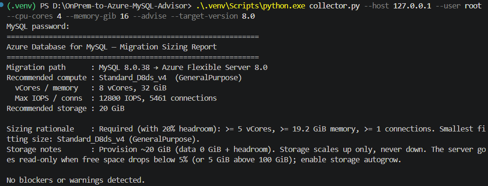
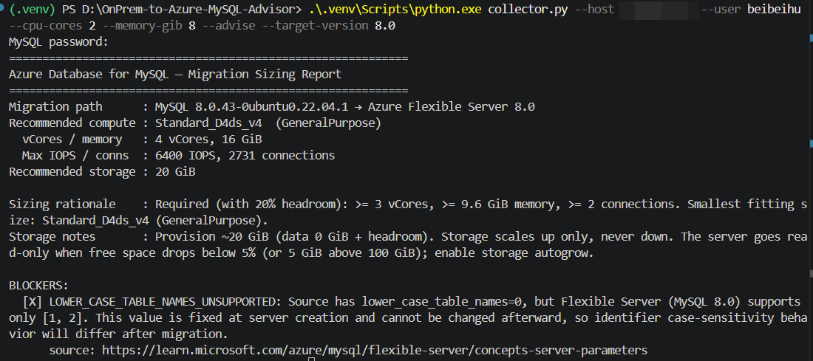

# OnPrem-to-Azure-MySQL-Advisor

A **pre-decision sizing & risk advisor** for migrating self-managed / on-prem MySQL to
**Azure Database for MySQL Flexible Server**.

You feed it your current server's specs and workload profile. It returns a recommended
SKU tier, IOPS/storage sizing, a parameter-compatibility report, and a list of hard
blockers — **before** you commit to the migration.

> Scope boundary: this advises **whether and how to size** the move. It does **not**
> move data. Execution is already well served by [Azure DMS](https://learn.microsoft.com/azure/dms/)
> and [MySQL Import](https://learn.microsoft.com/azure/mysql/migrate/).

---

## Background

This is Beibei Hu and I am currenly a support engineer for **Azure Database for MySQL and PostgreSQL** at Microsoft. A recurring pattern I see with
customers planning to move self-managed / on-prem MySQL onto Flexible Server is that the
official docs explain *how* to move the data very well — but the questions that actually
decide whether the migration goes smoothly are answered too late:

- they pick a SKU by matching vCore/RAM and get surprised that **IOPS is capped by compute
  size and provisioned storage**, not by vCore alone;
- an "unsupported" note scattered across many doc pages turns into a **mid-cutover blocker**
  (classic example: `lower_case_table_names` is fixed at server creation and can't be changed);
- restricted privileges (`SUPER`, no `root`) or not-exposed / restart-required parameters
  only surface once something breaks.

I built this advisor to pull those surprises **forward** — to the sizing-and-planning stage,
before anyone commits. The decision logic is a deterministic, source-tagged core (no LLM
inventing spec numbers) so the same input always yields the same, verifiable recommendation.

---

## "There are already migration docs. Why do I need this?"

Microsoft's docs are excellent at telling you **how to move the bytes**. They do not tell
you, for *your specific server*, the three questions that actually decide success:

| Question you actually have | What the docs give you | What this advisor gives you |
|---|---|---|
| **Which SKU do I pick?** | A feature/limit matrix for all tiers | A concrete recommendation for *your* vCore / memory / IOPS / storage, derived from your workload |
| **What will break after I move?** | A scattered list of "unsupported" notes across many pages | One consolidated compatibility report against *your* current config |
| **What will hard-fail the migration?** | Generic prerequisites | The specific blockers that apply to *you*, surfaced up front |

The docs are a **generic how-to**. This is a **personalized what-for-you + what-could-go-wrong**.

A migration guide is a map of the road. This is the part that says *"with your load, take a
D-series with provisioned IOPS, and by the way these 3 settings of yours won't survive the trip."*

---

## The three things it checks for you

1. **Sizing** — maps your CPU / memory / disk / IOPS / connection usage onto a recommended
   Flexible Server tier (Burstable / General Purpose / Memory Optimized) with justified
   IOPS and storage estimates. IOPS on Flexible Server is capped per compute size and by
   provisioned storage, *not* derived from vCore alone — a classic sizing mistake this is
   built to catch.

2. **Parameter & feature compatibility** — diffs your current MySQL settings against what
   Flexible Server actually allows. Flags the well-known traps, e.g.:
   - no `SUPER` privilege / no `root`
   - `lower_case_table_names` is fixed at creation time and cannot be changed later
   - parameters that are not-exposed, read-only, or require a restart
   - `innodb_buffer_pool_size` being derived from the chosen memory tier

3. **Blockers** — things that will stop a migration before it starts, so you find them on
   day zero instead of mid-cutover.

Output: a structured report (machine-readable + human summary).

---

## Why a deterministic core, not "just ask an LLM"

Sizing numbers and platform limits must be **reproducible and sourced** — a tool that
hallucinates an IOPS ceiling is worse than no tool.

- The decision logic (SKU selection, IOPS/storage math, version-path and parameter checks)
  lives in a **deterministic, unit-tested core**. Same input → same recommendation, every time.
- **The shipped tool uses zero LLM.** No recommendation is ever produced by a model. An
  optional "explain" layer may later use an LLM only to *restate* an already-computed result
  in plain language — it will never invent or alter a spec number.
- Every Azure limit or default cited by the tool is **traceable to an official source**
  (see the `source` field on every finding and on the SKU catalog). Anything unverified is
  marked as a placeholder, not shipped as fact.

---

## How to use

### Prerequisites

- Python 3.10+
- Install dependencies (ideally in a virtual environment):

  ```powershell
  python -m venv .venv
  .\.venv\Scripts\Activate.ps1        # Windows PowerShell
  pip install -r requirements.txt
  ```

The advisor has two entry points:

- **`collector.py`** — connects to a live source MySQL (read-only) and gathers most of the
  profile automatically. Needs network access to the source DB.
- **`cli.py`** — takes a profile YAML and prints the recommendation. Fully offline; no DB,
  no network, no LLM.

### Option A — one command (collect + advise)

If you can reach the source database, this does everything at once and prints the report:

```powershell
python collector.py --host 127.0.0.1 --user root --cpu-cores 4 --memory-gib 16 --advise --target-version 8.0
```

You'll be prompted for the password (it is never passed on the command line). That's it —
the sizing report prints to the screen.

### Option B — collect to a file, review, then advise

```powershell
# 1. Collect into a YAML file you can inspect / tweak
python collector.py --host 127.0.0.1 --user root --cpu-cores 4 --memory-gib 16 --out profile.yaml

# 2. Advise from that file
python cli.py profile.yaml --target-version 8.0
```

### Option C — no database access (write the profile by hand)

If you can't connect the source DB from where you run this, copy `sample_input.yaml`, fill
in the values from whatever you know about the server, and run:

```powershell
python cli.py my_profile.yaml --target-version 8.0
```

---

## Parameter reference

### `collector.py` (gather a profile from a live source)

| Flag | Required | Meaning |
|---|---|---|
| `--host` | yes | Source MySQL hostname or IP to connect to. |
| `--port` | no (default `3306`) | Source MySQL TCP port. |
| `--user` | yes | MySQL user to connect as. A read-only account is sufficient; only `SELECT`/`SHOW` are issued. |
| `--ssl-ca` | no | Path to a CA certificate to require a TLS connection. Omit for a plaintext local connection. |
| `--cpu-cores` | no* | Physical CPU cores of the **source host**. MySQL cannot report this, so you supply it. |
| `--memory-gib` | no* | RAM of the **source host** in GiB. Also not observable from within MySQL. |
| `--peak-iops` | no | Observed peak IOPS from OS / storage monitoring, if you have it. Left unset → sizing estimates IOPS from data size only. |
| `--out` | no | Write the profile YAML to this file. Omitted → YAML goes to stdout (unless `--advise`). |
| `--advise` | no | After collecting, immediately run the advisor and print the report (Option A). |
| `--target-version` | no (default `8.0`) | Azure target major version for `--advise` (see below). |

\* `--cpu-cores` and `--memory-gib` are optional for plain collection, but **required if you
use `--advise`** (the advisor can't size without them). The password comes from the
`MYSQL_PWD` environment variable if set, otherwise you're prompted — never put it on the
command line.

### `cli.py` (advise from a profile file)

| Flag | Required | Meaning |
|---|---|---|
| `input` | yes | Path to a profile YAML describing the source server. |
| `--target-version` | no (default `8.0`) | Azure MySQL Flexible Server major version you intend to create. Creatable GA targets today are **`8.0`** and **`8.4`**. `5.7` is retired (can't create new servers); `9.5` is an innovation preview, not a production target. |
| `--json` | no | Emit the full result as JSON instead of the text report (for scripting). |

---

## Profile fields (the YAML)

A profile describes the **source** server. `collector.py` fills most of it in; you can also
write it by hand. Fields:

| Field | Type | Meaning |
|---|---|---|
| `mysql_version` | string | Source MySQL version, e.g. `8.0.36`. Its major version (`8.0`) drives the upgrade-path check. |
| `cpu_cores` | int | Source host CPU cores. Sizing adds headroom on top of this. |
| `memory_gib` | number | Source host RAM in GiB. Drives tier choice (memory-heavy → Memory Optimized). |
| `data_size_gib` | number | Total data + index size in GiB. Drives the storage estimate. Auto-collected. |
| `peak_iops` | int or null | Peak IOPS the workload actually hits. If set, the recommended compute size must meet it. `null` → not constrained by IOPS. |
| `peak_connections` | int or null | Peak concurrent connections (auto-collected from `Max_used_connections`). The compute size must offer at least this many. |
| `is_production` | bool | If `true`, Burstable tier is excluded (it's not for production). |
| `requires_ha` | bool | Needs zone-redundant / same-zone HA. Excludes Burstable (HA unsupported there). |
| `requires_read_replica` | bool | Needs read replicas. Also excludes Burstable. |
| `params` | map | Source server parameters that matter for compatibility, e.g. `{ lower_case_table_names: "0" }`. |
| `storage_engines` | list | Storage engines in use, e.g. `[InnoDB, MyISAM]`. Unsupported engines become blockers. |
| `privileges_used` | list | Privileges the workload relies on, e.g. `[SUPER]`. Restricted privileges become warnings. |
| `features_used` | list | Reserved for future schema-level checks. |

---

## Reading the output

The report has three severity levels, and the process exit code reflects the worst one:

| Level | Meaning | Exit code impact |
|---|---|---|
| **BLOCKER** | Will stop the migration; must be resolved first (e.g. unsupported storage engine, `lower_case_table_names=0`, version downgrade). | Exit code `1` |
| **WARNING** | Migration can proceed, but something needs attention (e.g. cross-major upgrade, restricted privileges). | Exit code `0` |
| **INFO** | Context worth knowing (e.g. an in-place same-version migration). | Exit code `0` |

Every finding carries a `source` URL so you can verify it. `collector.py --advise` returns
exit code `2` if it can't advise because a required host field is missing.

---

## Example output

Running the advisor against a live source MySQL (`collector.py --advise`) produces a
sizing + compatibility report. Example runs:

**Local source**



**Azure VM source (remote)**



---

## Status

Decision rules grow one real migration pitfall at a time, each backed by a test. This is
intentionally **not** a generic framework built up front. All Azure spec numbers are
transcribed from official docs with source tags; unverified values are placeholders, never
guesses.

## Project layout

```
advisor/
  core.py            # decision engine (the single source of rules)
  models.py          # dataclass inputs / outputs
  collect.py         # read-only collection mapping (pure, testable)
  specs/             # Azure SKU / parameter / version spec data (each value source-tagged)
cli.py               # offline advise front end
collector.py         # live-DB collector (+ optional --advise)
sample_input.yaml    # example profile
tests/               # pytest — one case per rule
```
